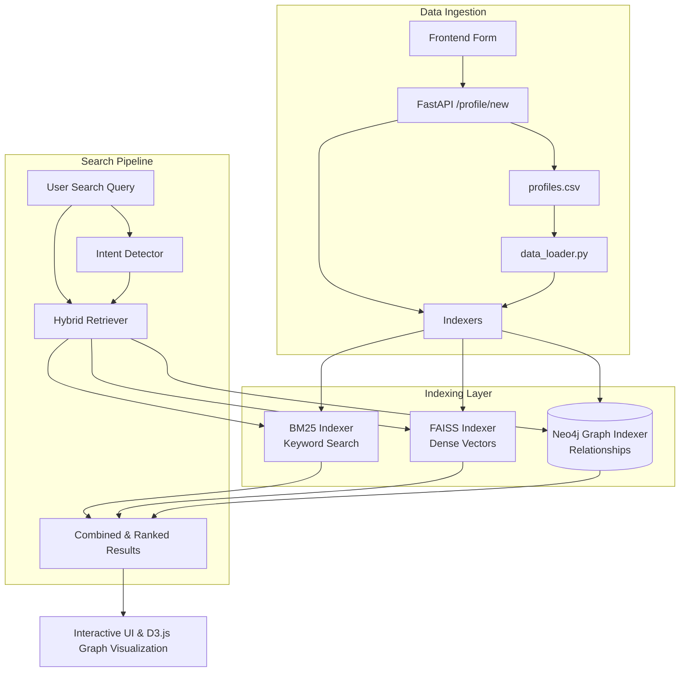

# Intent-Aware and Explainable Hybrid Retrieval System

## Overview
This project implements a production-grade, multi-stage hybrid candidate retrieval system designed to find the best job candidates based on user intent. It utilizes a combination of traditional keyword search (BM25), dense vector similarity (FAISS), and structured relationship querying (Neo4j Knowledge Graph). 

The system provides an interactive frontend UI with explainable results, ensuring transparency in why specific candidates were matched.

## Team Members
Aman Kumar
Anant Kumar
Akshat Tripathi
Ankit Saini
Arindam Mukherjee
Somesh Dahiya
Mahak Aggarwal
Kripa Kanodia
T Monica

## Features
- **Hybrid Retrieval Pipeline:** Combines BM25, FAISS, and Knowledge Graph (Neo4j) for highly accurate and context-aware candidate matching.
- **Intent Detection:** Automatically detects search intent to prioritize specific skills or roles.
- **Knowledge Graph Visualization:** An interactive, force-directed graph (using D3.js) to visualize relationships between candidates, skills, and roles.
- **Real-time Incremental Updates:** Add or update candidate profiles dynamically via the UI or `input.py` without requiring a full index rebuild.
- **Robust Evaluation:** Includes both heuristic IR metrics evaluation (`evaluate.py`) and LLM-as-a-judge evaluation via RAGAS (`evaluate_ragas.py`).

## Architecture & Data Flow



## Project Architecture
```text
DL_Hackathon/
├── data/
│   └── profiles.csv             # The candidate database
├── src/
│   ├── core/                    # Core system logic
│   │   ├── data_loader.py       # Reads and cleans CSV data
│   │   └── retriever.py         # Hybrid search logic & Intent detection
│   ├── indexing/                # Indexing mechanisms
│   │   ├── bm25_indexer.py      # Keyword-based indexing
│   │   ├── faiss_indexer.py     # Dense vector indexing
│   │   └── graph_indexer.py     # Neo4j knowledge graph indexing
│   └── models/
│       └── schema.py            # Pydantic data models
├── static/
│   └── style.css                # Application styling
├── templates/
│   ├── index.html               # Main search interface
│   └── graph.html               # Graph visualization interface
├── main.py                      # FastAPI application entry point
├── input.py                     # Script for data ingestion/management
├── evaluate.py                  # Standard IR metrics evaluation (P@K, R@K, nDCG)
├── evaluate_ragas.py            # RAGAS framework evaluation (Context Precision/Recall)
├── requirements.txt             # Python dependencies
├── run.bat / run.ps1            # Quick start scripts for Windows
└── README.md                    # This documentation file
```

## Setup and Installation

### Prerequisites
- Python 3.9+
- Neo4j Database (can be run locally via Docker)
- Ollama (installed locally for completely offline LLM evaluation via `evaluate_ragas.py`)

### Installation
1. Clone the repository and navigate to the project directory:
   ```bash
   git clone <repository-url>
   cd DL_Hackathon
   ```
2. Install the required dependencies:
   ```bash
   pip install -r requirements.txt
   ```

3. **(Optional)** If you want to run the offline LLM evaluation via RAGAS, make sure you have pulled the required Ollama models:
   ```bash
   ollama pull mistral
   ollama pull nomic-embed-text
   ```

### Running the Application
You can start the FastAPI backend and serve the frontend by running one of the provided startup scripts:
```bash
./run.bat
# or using PowerShell
./run.ps1
```
Alternatively, start the server manually using `uvicorn`:
```bash
uvicorn main:app --host 0.0.0.0 --port 8000 --reload
```
Once started, access the application at `http://localhost:8000`.

---

## Complete Procedure to Push to GitHub
Follow these precise steps to commit your final code and push it to your GitHub repository for submission.

1. **Initialize Git (if not already initialized):**
   ```bash
   git init
   ```

2. **Stage All Changes:**
   Add all your files to the staging area. The `.gitignore` file will ensure temporary files are excluded.
   ```bash
   git add .
   ```

3. **Commit the Changes:**
   Commit the finalized system with a descriptive message.
   ```bash
   git commit -m "Final submission: Intent-Aware and Explainable Hybrid Retrieval System"
   ```

4. **Set the Main Branch:**
   Ensure your default branch is set to `main` (the modern standard).
   ```bash
   git branch -M main
   ```

5. **Link Your Remote Repository:**
   Replace `<repository-url>` with your actual GitHub repository URL (e.g., `https://github.com/username/repo-name.git`). If you have already added the remote, you can skip this step.
   ```bash
   git remote add origin <repository-url>
   ```

6. **Push the Code:**
   Push your committed code to the GitHub repository.
   ```bash
   git push -u origin main
   ```

> **Note:** If you encounter errors because the remote repository contains files you do not have locally (like a default README or License), you might need to pull those first: `git pull origin main --rebase`, and then run the push command again.
